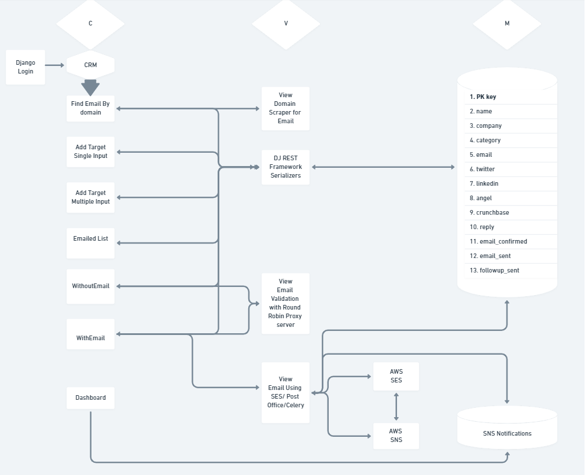

# Lead and Email Management / CRM

<!--  -->

[](https://github.com/giterdun345/Email_leadManagement/contributors/)
[](https://github.com/giterdun345/Email_leadManagement/forks/)
[](https://github.com/giterdun345/Email_leadManagement/stargazers)
[](https://github.com/giterdun345/Email_leadManagement/issues/)
[](https://github.com/giterdun345/Email_leadManagement/blob/master/LICENSE)
[![LinkedIn][linkedin-shield]](https://linkedin.com/in/jm-ketterer)

<!-- PROJECT LOGO -->
<br />
<p align="center">
  <h3 align="center">Lead and Email Management</h3>
  <p align="center">
    This is a CRM built with email capabilities, web scraping and scheduling. The app contains views with a rotating proxy server to check if an email exists, a web scraper that w     will search a website and its links for emails and a connection to AWS SES/SNS to send emails and recieve the analytics such as bounce rate, black listed emails and     complaints. This is created for someone who wanted to find investors for a startup company. I am not a fan of spamming so please do not use this for such purposes.
    <br />
    I am in need of some help putting the last bit together and am open to collaboration!!
    <br />
    <a href="https://github.com/giterdun345/Email_lead_Management"><strong>Explore the docs »</strong></a>
    <br />
    <br />
    <a href="https://github.com/giterdun345/Email_leadManagement">View Demo (soon)</a>
    ·
    <a href="https://github.com/giterdun345/Email_leadManagement/issues">Report Bug</a>
    ·
    <a href="https://github.com/giterdun345/Email_leadManagement/issues">Request Feature</a>
  </p>
</p>

<!-- TABLE OF CONTENTS -->
<details open="open">
  <summary><h2 style="display: inline-block">Table of Contents</h2></summary>
  <ol>
    <li>
      <a href="#about-the-project">About The Project</a>
      <ul>
        <li><a href="#built-with">Built With</a></li>
      </ul>
    </li>
    <li>
      <a href="#getting-started">Getting Started</a>
      <ul>
        <li><a href="#prerequisites">Prerequisites</a></li>
        <li><a href="#installation">Installation</a></li>
      </ul>
    </li>
    <li><a href="#usage">Usage</a></li>
    <li><a href="#roadmap">Roadmap</a></li>
    <li><a href="#contributing">Contributing</a></li>
    <li><a href="#license">License</a></li>
    <li><a href="#contact">Contact</a></li>
    <li><a href="#acknowledgements">Acknowledgements</a></li>
  </ol>
</details>

<!-- ABOUT THE PROJECT -->

## About The Project


### Built With
<ul>
  <li>React</li>
  <li>Django</li>
  <li>Django Rest Framework</li>
  <li>SQLite (current) or PostgreSQL (maybe?)</li>
  <li>AWS</li>
  <li>Ant Design</li>
  <li>Much More...</li>
</ul>

<!-- GETTING STARTED -->
## Getting Started

To get a local copy up and running follow these simple steps.

### Prerequisites
RealEmail API Key

### Installation

1. Clone the repo
   ```sh
   git clone https://github.com/giterdun345/Email_leadManagement.git
   ```
2. Install NPM packages frontend
   ```sh
   npm install
   ```
3. pip install requirements.txt
   
<!-- USAGE EXAMPLES -->
## Usage
Details to come soon

<!-- ROADMAP -->

## Roadmap

<ul>
  <li>Implement multithreading for email validation</li>
  <li>Add view and component for the scraper (scrapes a given website for emails)</li>
  <li>Finish email setup with SES and SNS</li> 
  <li>Need some HTML templates for the emails to be sent</li>

 </ul>
 
  See the [open issues](https://github.com/giterdun345/Email_leadManagement/issues) for a list of proposed features (and known issues).


## Contributing

Contributions are what make the open source community such an amazing place to be learn, inspire, and create. Any contributions you make are **greatly appreciated**.

1. Fork the Project
2. Create your Feature Branch (`git checkout -b feature/AmazingFeature`)
3. Commit your Changes (`git commit -m 'Add some AmazingFeature'`)
4. Push to the Branch (`git push origin feature/AmazingFeature`)
5. Open a Pull Request

<!-- LICENSE -->

## License

Distributed under the CC License. See `LICENSE` for more information.

<!-- CONTACT -->

## Contact

John Ketterer - johnmketterer@gmail.com

Project Link: [https://github.com/giterdun345/Email_leadManagement](https://github.com/giterdun345/Emaillead_Management)

<!-- ACKNOWLEDGEMENTS -->

## Acknowledgements
<ul>
  <li>Big shout out to Ant Design! Thank you for letting me focus more on the logic rather than UI</li>
 </ul>

<!-- MARKDOWN LINKS & IMAGES -->
<!-- https://www.markdownguide.org/basic-syntax/#reference-style-links -->

[contributors-shield]: https://img.shields.io/github/contributors/giterdun345/repo.svg?style=for-the-badge
[contributors-url]: https://github.com/giterdun345/repo/graphs/contributors
[forks-shield]: https://img.shields.io/github/forks/giterdun345/repo.svg?style=for-the-badge
[forks-url]: https://github.com/giterdun345/repo/network/members
[stars-shield]: https://img.shields.io/github/stars/giterdun345/repo.svg?style=for-the-badge
[stars-url]: https://github.com/giterdun345/repo/stargazers
[issues-shield]: https://img.shields.io/github/issues/giterdun345/repo.svg?style=for-the-badge
[issues-url]: https://github.com/giterdun345/repo/issues
[license-shield]: https://img.shields.io/github/license/giterdun345/repo.svg?style=for-the-badge
[license-url]: https://github.com/giterdun345/repo/blob/master/LICENSE.txt
[linkedin-shield]: https://img.shields.io/badge/-LinkedIn-black.svg?style=for-the-badge&logo=linkedin&colorB=555
[linkedin-url]: https://linkedin.com/in/jm-ketterer
